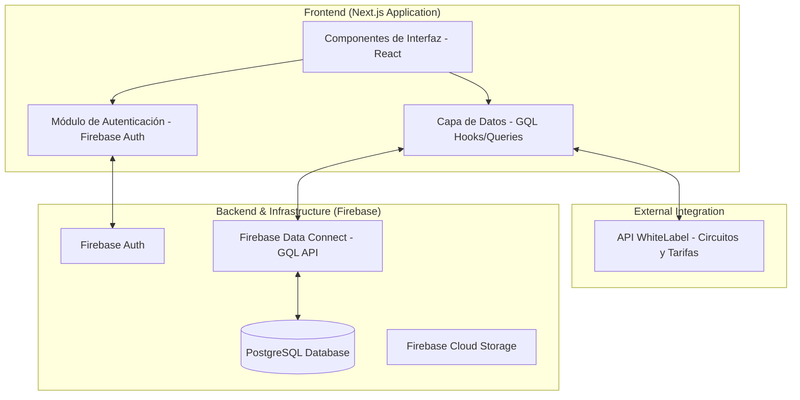
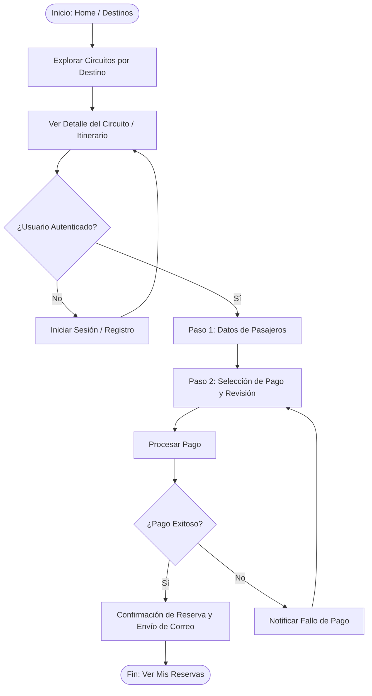
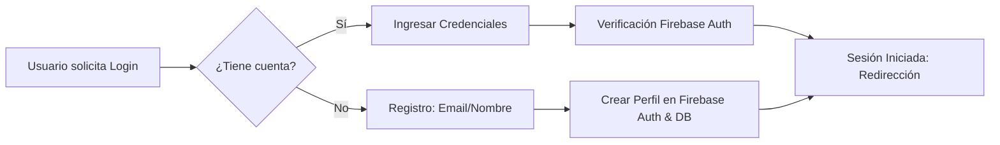
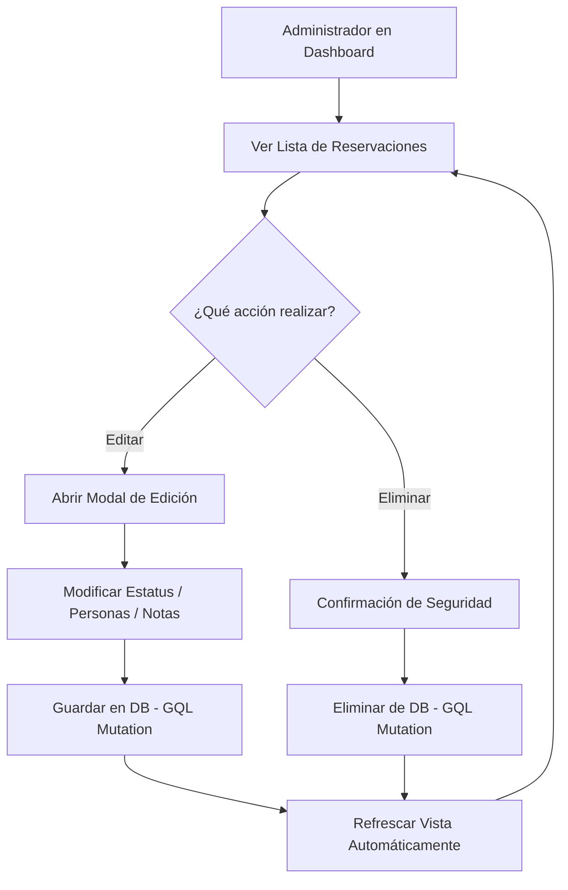
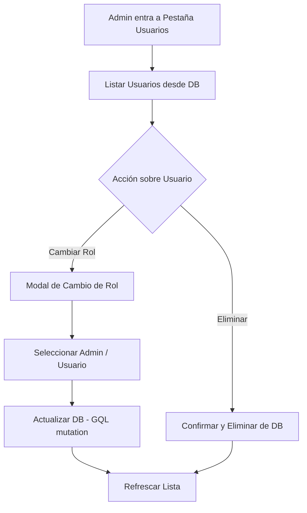

# Evidencias Tecnológicas - Proyecto Inturmex

Este documento recopila la información técnica relevante del sistema Inturmex, detallando su arquitectura, diseño de datos e integraciones.

---

## 1. Diseño UI - UX (Vistas)
El diseño de la interfaz de usuario se centró en ofrecer una experiencia "Premium" y fluida para el viajero. Se implementaron los siguientes principios:
- **Estética Moderna**: Uso de componentes con bordes redondeados, sombras suaves y una paleta de colores coherente (tonos azules y dorados/arenas para evocar viajes y lujo).
- **Responsividad**: La interfaz es totalmente adaptable a dispositivos móviles, tablets y escritorio.
- **Interacción Dinámica**: Micro-animaciones en tarjetas de circuitos y transiciones suaves entre páginas.
- **Enfoque en el Contenido**: Priorización de imágenes de alta resolución de los destinos para captar la atención del usuario.

*Nota: Las capturas de pantalla de las vistas se encuentran en el documento de diseño correspondiente.*

---

## 2. Arquitectura de Módulos del Sistema (Diagramas)
La arquitectura de Inturmex es de tipo monorepo basada en **Next.js** y **Firebase**, lo que permite una escalabilidad rápida y una integración eficiente entre el frontend y el backend.

### Diagrama de Arquitectura de Módulos



---

## 3. Diagramas de Flujo de Procesos
A continuación se detallan los procesos principales que el usuario puede realizar en la plataforma.

### Proceso de Reserva de Paquete Turístico
Este flujo describe el camino desde la exploración hasta la confirmación de una reserva.



### Proceso de Autenticación de Usuario


### Proceso de Gestión Administrativa (Reservaciones)
Este flujo describe cómo un administrador gestiona las ventas y el estatus de los viajes.



### Proceso de Gestión de Usuarios y Roles


---

## 4. Diseño de Bases de Datos
El sistema utiliza **Firebase Data Connect**, que gestiona una base de datos **PostgreSQL** relacional. A continuación se detallan las entidades principales:

- **User**: Gestión de perfiles de usuario con Control de Acceso Basado en Roles (RBAC: Admin/Usuario).
- **Destino**: Catálogo de destinos turísticos (Nombre, Slug, Imagen, Orden).
- **Circuito**: Definición de recorridos turísticos con su información base (Días, Precio, País/Ciudades).
- **Paquete**: Ofertas específicas vinculadas a circuitos.
- **Reservacion**: Registro de compras y reservas de usuarios.
- **Itinerario**: Detalle día a día de cada circuito.
- **Hotel**: Información de alojamiento por ciudad en cada circuito.
- **Tarifa**: Precios detallados según temporada y tipo de habitación.
- **Promocion**: Banners y ofertas destacadas.

---

## 4. Explicación de API WhiteLabel
Para la obtención de circuitos, itinerarios y tarifas en tiempo real, el sistema se integra con una **API WhiteLabel** de proveedores mayoristas. 

> [!IMPORTANT]
> **Confidencialidad**: Debido a acuerdos de confidencialidad y términos de servicio del proveedor, los detalles técnicos sensibles de los endpoints, llaves de API y estructuras internas de respuesta no se muestran en su totalidad en esta documentación. Sin embargo, se confirma su uso para alimentar el catálogo de circuitos internacionales del sistema.

---

## 5. Evidencia del funcionamiento de la Base de Datos
La conexión entre la interfaz y la base de datos se realiza mediante consultas GraphQL generadas por Firebase Data Connect. Esto garantiza integridad de tipos y eficiencia en la transferencia de datos.

### Ejemplo de Integración Técnica
Cuando el usuario accede a la lista de destinos, el frontend ejecuta la siguiente query:

```graphql
query GetDestinos {
  destinos(where: { activo: { eq: true } }, orderBy: [{ orden: ASC }]) {
    id
    nombre
    slug
    imagenUrl
  }
}
```

La base de datos responde en milisegundos, permitiendo que la interfaz renderice dinámicamente las tarjetas de destinos con información real almacenada en PostgreSQL.

---

## 6. Repositorio GitHub
El código fuente del proyecto se encuentra alojado en GitHub, siguiendo un flujo de trabajo de GitFlow para el desarrollo de nuevas características y mantenimiento.

- **Organización**: El proyecto utiliza **Turborepo** para gestionar las aplicaciones (`web`, `firebase`) y los esquemas de base de datos (`dataconnect`) en un solo lugar.
- **Control de Versiones**: Se mantienen ramas de desarrollo y producción para asegurar la estabilidad del sitio en vivo.
